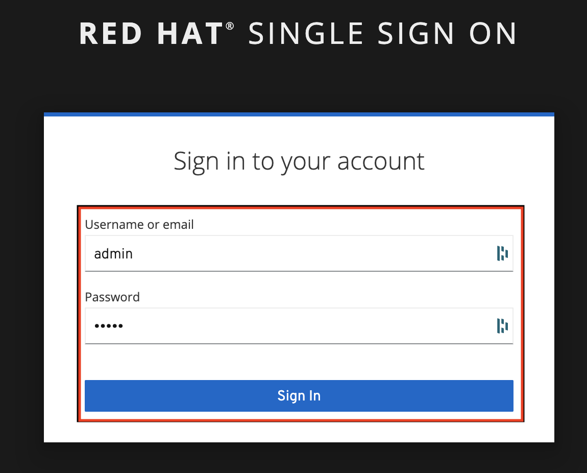
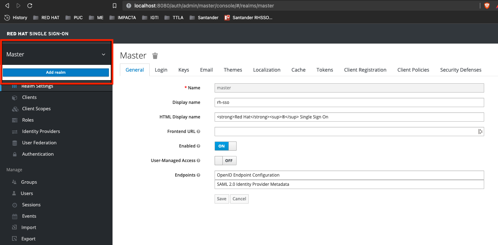
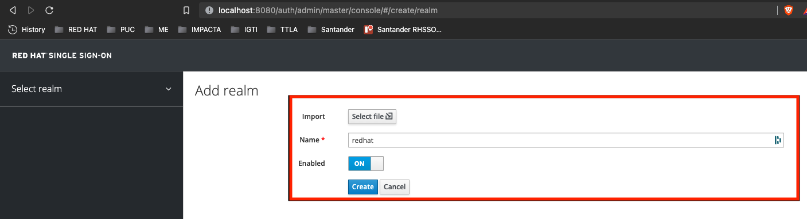
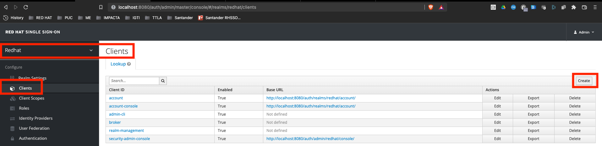
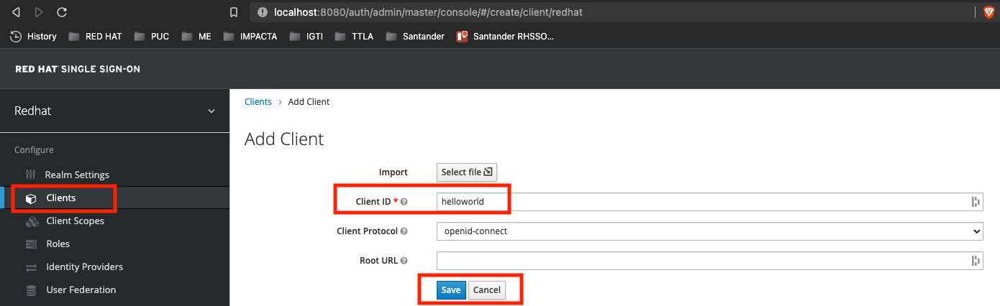
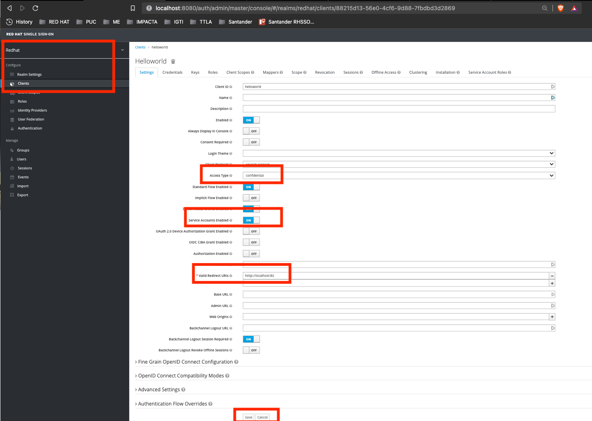
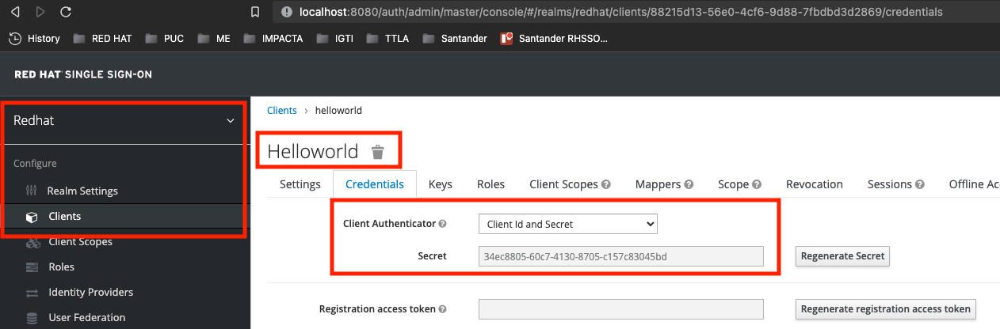

# RH-SSO Client Credentials Demo

## Description

The following is intended to showcase some of the key features provided by [Red Hat Single Sign On 7.5.x](https://access.redhat.com/products/red-hat-single-sign-on), specially when using [Client Credentials](https://datatracker.ietf.org/doc/html/rfc6749#section-1.3.4)

## Environment & Prerequisites

- [Red Hat Single Sign On 7.5](https://access.redhat.com/products/red-hat-single-sign-on)
- [Docker](https://www.docker.com/)
- [Podman](https://podman.io/)
- [Curl](https://curl.se/)
- [Jq](https://stedolan.github.io/jq/)

## Building from Source

* In order to customize/extend the current **Red Hat Single Sign On** image used on this workshop, update or create a new *Dockerfile* within your requirements and rebuild it as you wish. Example:

  ```
  docker build -t mydockerhubuser/rhsso75:1.0 -f container/rhsso75/Dockerfile-rhsso-75 .
  ```

## Agenda

0. [RH-SSO Deployment](#clientcredentials-step-0)
1. [RH-SSO Setup](#clientcredentials-step-1)
2. [RH-SSO HelloWorld Client Credentials Setup](#clientcredentials-step-2)
3. [RH-SSO HelloWorld Client Credentials Test](#clientcredentials-step-3)

## Deployment

### 0. RH-SSO Deployment <a name="clientcredentials-step-0">

* Before moving forward, make sure your *Container Runtime (docker, podman)* is running;

* Launch your **RH-SSO 7.5** instance by running:

  ```
  docker run -it -p 8080:8080 viniciusmartinez/rhsso75:1.0
  ```

* After a few seconds the following message is expected indicating **RH-SSO instance** is started successfully;

  ```
  15:12:33,875 INFO  [org.wildfly.extension.undertow] (ServerService Thread Pool -- 89) WFLYUT0021: Registered web context: '/auth' for server 'default-server'
  15:12:33,958 WARN  [org.jgroups.protocols.kubernetes.KUBE_PING] (thread-5,null,0008aebf7899) failed getting JSON response from Kubernetes Client[masterUrl=https://null:0/api/v1, headers={}, connectTimeout=5000, readTimeout=30000, operationAttempts=3, operationSleep=1000, streamProvider=org.jgroups.protocols.kubernetes.stream.TokenStreamProvider@412f8410] for cluster [ee], namespace [default], labels [null]; encountered [java.lang.Exception: 3 attempt(s) with a 1000ms sleep to execute [OpenStream] failed. Last failure was [java.net.UnknownHostException: null]]
  15:12:34,042 INFO  [org.jboss.as.server] (ServerService Thread Pool -- 73) WFLYSRV0010: Deployed "keycloak-server.war" (runtime-name : "keycloak-server.war")
  15:12:34,154 INFO  [org.jboss.as.server] (Controller Boot Thread) WFLYSRV0212: Resuming server
  15:12:34,162 INFO  [org.jboss.as] (Controller Boot Thread) WFLYSRV0025: WildFly Core 15.0.2.Final-redhat-00001 started in 32989ms - Started 717 of 1077 services (769 services are lazy, passive or on-demand)
  15:12:34,167 INFO  [org.jboss.as] (Controller Boot Thread) WFLYSRV0060: Http management interface listening on http://127.0.0.1:9990/management
  15:12:34,168 INFO  [org.jboss.as] (Controller Boot Thread) WFLYSRV0054: Admin console is not enabled
  ```

  * if the following *WARN* comes up, please ignore it. We're currently using an base image that's supposed to be executed on top of **Openshift:**

    ```
    WARN [org.jgroups.protocols.kubernetes.KUBE_PING] (thread-5,null,0008aebf7899) failed getting JSON response from Kubernetes Client[masterUrl=https://null:0/api/v1, headers={}, connectTimeout=5000, readTimeout=30000, operationAttempts=3, operationSleep=1000,streamProvider=org.jgroups.protocols.kubernetes.stream.TokenStreamProvider@412f8410] for cluster [ee], namespace [default], labels [null]; encountered [java.lang.Exception: 3 attempt(s) with a 1000ms sleep to execute [OpenStream] failed. Last failure was [java.net.UnknownHostException: null]]
    ```

### 1. RH-SSO Setup <a name="clientcredentials-step-1">

* Before moving forward, make sure your **RH-SSO instance** is up and running;

  ```
  INFO  [org.jboss.as.server] (ServerService Thread Pool -- 73) WFLYSRV0010: Deployed "keycloak-server.war" (runtime-name : "keycloak-server.war")
  INFO  [org.jboss.as.server] (Controller Boot Thread) WFLYSRV0212: Resuming server
  INFO  [org.jboss.as] (Controller Boot Thread) WFLYSRV0025: WildFly Core 15.0.2.Final-redhat-00001 started in 32989ms - Started 717 of 1077 services (769 services are lazy, passive or on-demand)
  INFO  [org.jboss.as] (Controller Boot Thread) WFLYSRV0060: Http management interface listening on http://127.0.0.1:9990/management
  INFO  [org.jboss.as] (Controller Boot Thread) WFLYSRV0054: Admin console is not enabled
  ```

* Access **RH-SSO Admin Console** by hitting on your *browser*: [http://localhost:8080/auth/admin/](http://localhost:8080/auth/admin/)

* Both *Username* and *Password* are: **admin**

  

* Let's create a [Realm](https://access.redhat.com/documentation/en-us/red_hat_single_sign-on/7.5/html-single/getting_started_guide/index#creating-first-realm_ ) called *redhat* by hover on the *Top Left Corner Arrow* and clicking on *Add Realm*

  

* At the *Name* textfield inform **redhat** and click on *Create*

  

### 2. RH-SSO HelloWorld Client Credentials Setup <a name="clientcredentials-step-2">

* Double-check if you're on **Red Hat Realm**, if not, please select it before moving forward

  

* Click on *Create* button

* For *Client ID* please use `helloworld` and click on *Save* button:

  

* Change the *Access Type* from *public* to *confidential*

* Inform `htttp://localhost:80` for *Valid Redirect URIs*

* Change the *Service Accounts Enabled* to **ON**

* Finally click on *Save* button:

  

* Notice that we have a new *Credentials* tab showcasing the *Secret*

  

  * please take note of the *secret* value

### 3. RH-SSO HelloWorld Client Credentials Test <a name="clientcredentials-step-3">

* Open a new terminal session and try to obtain a token from **Red Hat Single Sign On** using both *cURL* and *jq:*

  ```
  curl -s --location \
    --request POST 'http://localhost:8080/auth/realms/redhat/protocol/openid-connect/token' \
    --header 'Content-Type: application/x-www-form-urlencoded' \
    --data-urlencode 'client_id=helloworld' \
    --data-urlencode 'client_secret=34ec8805-60c7-4130-8705-c157c83045bd' \
    --data-urlencode 'grant_type=client_credentials' | jq
  ```
  * don't forget to update the *client_secret* with the correct values from your current environment;
  * if you receive an error message *(invalid_client or Invalid client credentials)* please review your current *client* configuration and your *http request*;

* A similar output is expected:

  ```
  {
    "access_token": "eyJhbGciOiJSUzI1NiIsInR5cCIgOiAiSldUIiwia2lkIiA6ICJxX2RmOTgwbW9FYkhvMllyUFRmclc0UVdsQzNxNEdSTnplazlBX05MZmlrIn0.eyJleHAiOjE2Mzc3MDMxMTYsImlhdCI6MTYzNzcwMjgxNiwianRpIjoiMWZiMzhhNTctYWJiZS00MTU0LTliNzUtNjRjZjM4NmY2YWU4IiwiaXNzIjoiaHR0cDovL2xvY2FsaG9zdDo4MDgwL2F1dGgvcmVhbG1zL3JlZGhhdCIsImF1ZCI6ImFjY291bnQiLCJzdWIiOiIzM2I2NmMzZS1iYmM4LTQ3MzctYmU4Mi00YWIzODVmMTlkMzgiLCJ0eXAiOiJCZWFyZXIiLCJhenAiOiJoZWxsb3dvcmxkIiwiYWNyIjoiMSIsInJlYWxtX2FjY2VzcyI6eyJyb2xlcyI6WyJkZWZhdWx0LXJvbGVzLXJlZGhhdCIsIm9mZmxpbmVfYWNjZXNzIiwidW1hX2F1dGhvcml6YXRpb24iXX0sInJlc291cmNlX2FjY2VzcyI6eyJhY2NvdW50Ijp7InJvbGVzIjpbIm1hbmFnZS1hY2NvdW50IiwibWFuYWdlLWFjY291bnQtbGlua3MiLCJ2aWV3LXByb2ZpbGUiXX19LCJzY29wZSI6InByb2ZpbGUgZW1haWwiLCJlbWFpbF92ZXJpZmllZCI6ZmFsc2UsImNsaWVudEhvc3QiOiIxNzIuMTcuMC4xIiwiY2xpZW50SWQiOiJoZWxsb3dvcmxkIiwicHJlZmVycmVkX3VzZXJuYW1lIjoic2VydmljZS1hY2NvdW50LWhlbGxvd29ybGQiLCJjbGllbnRBZGRyZXNzIjoiMTcyLjE3LjAuMSJ9.huMqsaYd1xx3SU_IB0XzjjQGufFPob5IVfXwgmdI2bLiifJK5v9WrCx608d7L2dHD46fuvueZvop4D8XzkBKN3nyhaV-8dqClMpu_5Pdtx4iyL4MR0Z3zCRYioL9jURiqimGdAvJAlbrQ6lWQ7RSC7Ip45Dqoh6G0sTB8jL9WORzZXoLviBHg0HqE2YkCsM6eHGJJC3aosCBpe_CyY3kTb_V5l9B4N7oyg_1qCR4RkWpHB4pKMONyTdngsi7WIsJuK0rSFg6JVH4ESSs5UNaa0Ns28ZkyDusU2E0jspZ2-sfMwzVI_1VYEIYQz1BIRxme0SAoxPXUvPfBdQn61nF3A",
    "expires_in": 300,
    "refresh_expires_in": 0,
    "token_type": "Bearer",
    "not-before-policy": 0,
    "scope": "profile email"
  }
  ```

## Additional References <a name="additional-references">

- [RH-SSO 7.5 Documentation](https://access.redhat.com/documentation/en-us/red_hat_single_sign-on/7.5)
- [OAuth Specification](https://datatracker.ietf.org/doc/html/rfc6749)
- [Client Credentials](https://datatracker.ietf.org/doc/html/rfc6749#section-1.3.4)
