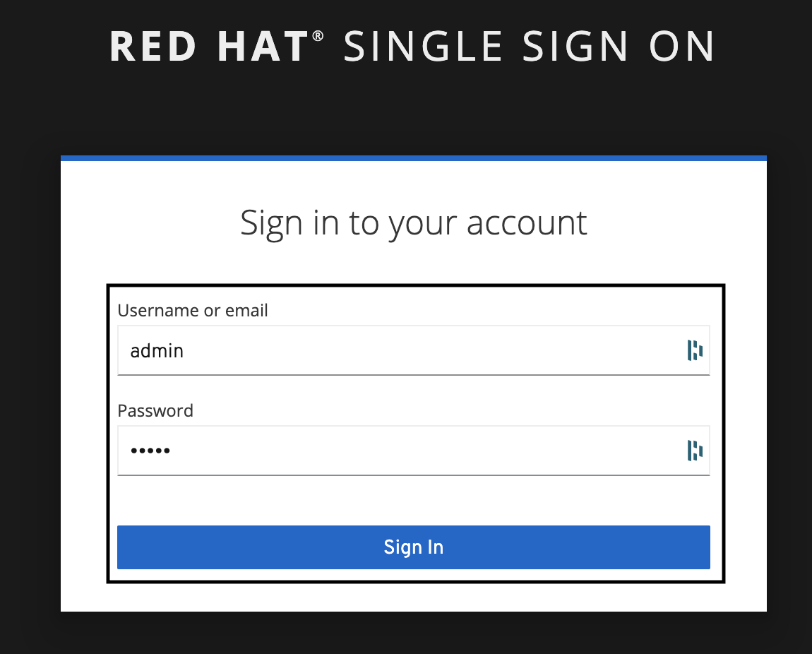

# RH-SSO Client Credentials Demo

## Description

The following is intended to showcase some of the key features provided by [Red Hat Single Sign On 7.5.x](https://access.redhat.com/products/red-hat-single-sign-on), specially when using [Client Credentials](https://datatracker.ietf.org/doc/html/rfc6749#section-1.3.4)

## Environment & Prerequisites

- [Red Hat Single Sign On 7.5](https://access.redhat.com/products/red-hat-single-sign-on)
- [Curl](https://curl.se/)
- [Docker](https://www.docker.com/)
- [Podman](https://podman.io/)

## Building from Source

* In order to customize/extend the current **Red Hat Single Sign On** image used on this workshop, update or create a new *Dockerfile* within your requirements and rebuild it as you wish. Example:

  ```
  docker build -t mydockerhubuser/rhsso75:1.0 -f container/rhsso75/Dockerfile-rhsso-75 .
  ```

## Agenda

0. [RH-SSO Deployment](#clientcredentials-step-0)
1. [RH-SSO Setup](#clientcredentials-step-1)

## Deployment

### 0. RH-SSO Deployment <a name="clientcredentials-step-0">

* Before moving forward, make sure your *Container Runtime (docker, podman)* is running;

* Launch your **RH-SSO 7.5** instance by running:

  ```
  docker run -it -p 8080:8080 viniciusmartinez/rhsso75:1.0
  ```

* After a few seconds the following message is expected indicating **RH-SSO instance** is started successfully;

  ```
  15:12:33,875 INFO  [org.wildfly.extension.undertow] (ServerService Thread Pool -- 89) WFLYUT0021: Registered web context: '/auth' for server 'default-server'
  15:12:33,958 WARN  [org.jgroups.protocols.kubernetes.KUBE_PING] (thread-5,null,0008aebf7899) failed getting JSON response from Kubernetes Client[masterUrl=https://null:0/api/v1, headers={}, connectTimeout=5000, readTimeout=30000, operationAttempts=3, operationSleep=1000, streamProvider=org.jgroups.protocols.kubernetes.stream.TokenStreamProvider@412f8410] for cluster [ee], namespace [default], labels [null]; encountered [java.lang.Exception: 3 attempt(s) with a 1000ms sleep to execute [OpenStream] failed. Last failure was [java.net.UnknownHostException: null]]
  15:12:34,042 INFO  [org.jboss.as.server] (ServerService Thread Pool -- 73) WFLYSRV0010: Deployed "keycloak-server.war" (runtime-name : "keycloak-server.war")
  15:12:34,154 INFO  [org.jboss.as.server] (Controller Boot Thread) WFLYSRV0212: Resuming server
  15:12:34,162 INFO  [org.jboss.as] (Controller Boot Thread) WFLYSRV0025: WildFly Core 15.0.2.Final-redhat-00001 started in 32989ms - Started 717 of 1077 services (769 services are lazy, passive or on-demand)
  15:12:34,167 INFO  [org.jboss.as] (Controller Boot Thread) WFLYSRV0060: Http management interface listening on http://127.0.0.1:9990/management
  15:12:34,168 INFO  [org.jboss.as] (Controller Boot Thread) WFLYSRV0054: Admin console is not enabled
  ```

  * if the following *WARN* comes up, please ignore it. We're currently using an base image that's supposed to be executed on top of **Openshift:**

    ```
    WARN [org.jgroups.protocols.kubernetes.KUBE_PING] (thread-5,null,0008aebf7899) failed getting JSON response from Kubernetes Client[masterUrl=https://null:0/api/v1, headers={}, connectTimeout=5000, readTimeout=30000, operationAttempts=3, operationSleep=1000,streamProvider=org.jgroups.protocols.kubernetes.stream.TokenStreamProvider@412f8410] for cluster [ee], namespace [default], labels [null]; encountered [java.lang.Exception: 3 attempt(s) with a 1000ms sleep to execute [OpenStream] failed. Last failure was [java.net.UnknownHostException: null]]
    ```

### 1. RH-SSO Setup <a name="clientcredentials-step-1">

* Before moving forward, make sure your **RH-SSO instance** is up and running;

  ```
  INFO  [org.jboss.as.server] (ServerService Thread Pool -- 73) WFLYSRV0010: Deployed "keycloak-server.war" (runtime-name : "keycloak-server.war")
  15:12:34,154 INFO  [org.jboss.as.server] (Controller Boot Thread) WFLYSRV0212: Resuming server
  INFO  [org.jboss.as] (Controller Boot Thread) WFLYSRV0025: WildFly Core 15.0.2.Final-redhat-00001 started in 32989ms - Started 717 of 1077 services (769 services are lazy, passive or on-demand)
  INFO  [org.jboss.as] (Controller Boot Thread) WFLYSRV0060: Http management interface listening on http://127.0.0.1:9990/management
  INFO  [org.jboss.as] (Controller Boot Thread) WFLYSRV0054: Admin console is not enabled
  ```

* Access **RH-SSO Admin Console** by hitting on your *browser*: ´http://localhost:8080/auth/admin/´

* Both *Username* and *Password* are **admin**

  * 

## Additional References <a name="additional-references">
